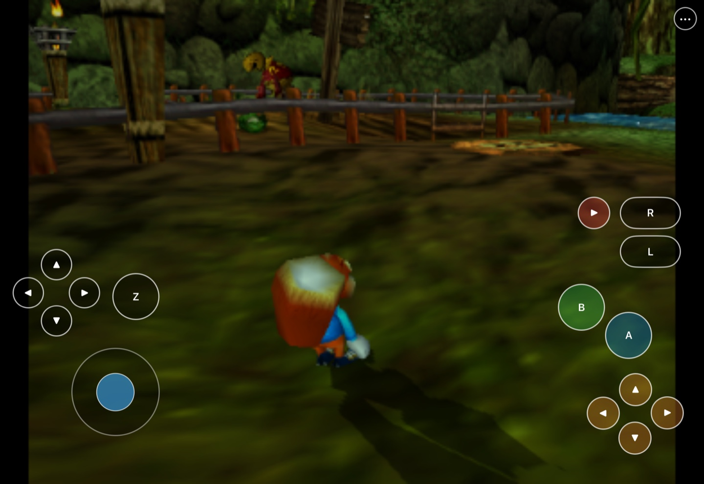
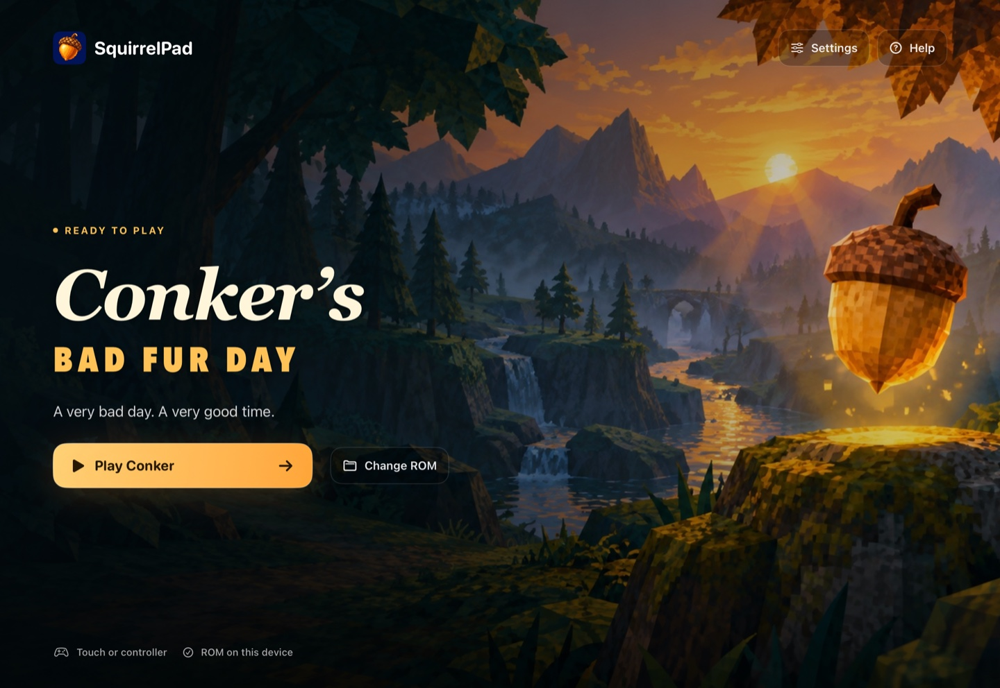
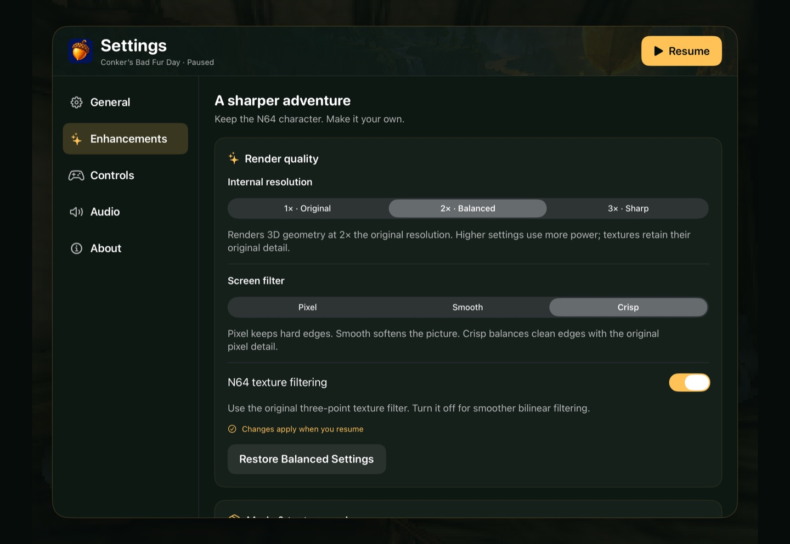
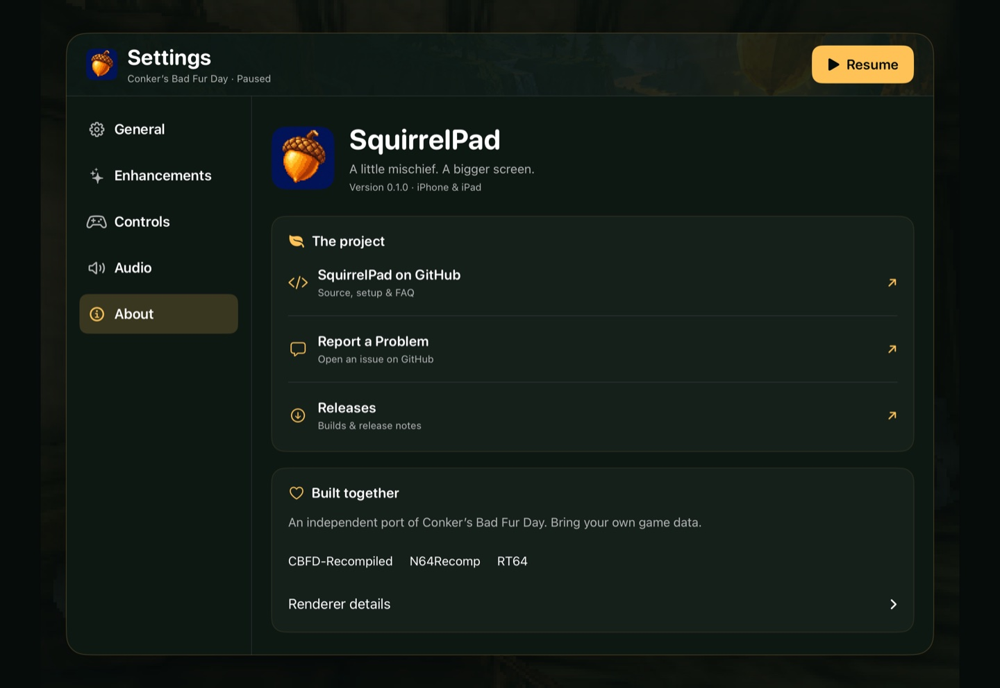

# SquirrelPad

<p align="center">
  <br>
  <strong>Conker's Bad Fur Day, native on iPhone and iPad.</strong><br>
  Static recompilation, Metal rendering, customizable touch controls, and controller support.
</p>

<p align="center">
  
  
  
  
  <a href="https://github.com/chrissotraidis/padmint"></a>
  
  
</p>

SquirrelPad brings [CBFD-Recompiled](https://github.com/sciaschi/CBFD-Recompiled)
to iPhone and iPad with an RT64 Metal renderer, Files-based ROM import,
editable touch layouts, controller bindings, local EEPROM saves, and selectable
1×–3× rendering. Optional camera, audio, HUD, and accessibility improvements
are built in. Experimental Picture lab presets add adjustable color, glow,
clarity and CRT scanlines.

<p align="center">
  <br>
  <sub>Actual iPadOS 27 Simulator capture. Your own game data is required.</sub>
</p>

<details>
<summary><strong>See the launcher and settings</strong></summary>



Launcher captured on an M2 iPad Pro running iPadOS 27.0.1.





</details>

**Experimental alpha:** Simulator builds reach gameplay, and a signed build runs on
an M2 iPad Pro. Sustained hardware play, full-story compatibility, audio
quality, and progressed-save reloads still need verification. iOS 17 is the build
minimum, not a tested-device guarantee. See [release readiness](docs/RELEASE_READINESS.md).

## Get started

You need an **Apple Silicon Mac, full Xcode with the iOS platform and Metal
Toolchain**, about **30 GB free for the build**, and your own supported US ROM.
Install the build tools once:

```sh
brew install cmake ninja python pkgconf sdl2 freetype ripgrep
```

Use **PadMint 0.4.11 or newer** for the SquirrelPad catalog entry, or
[build from this checkout](#build-from-this-checkout).

1. Open [PadMint](https://github.com/chrissotraidis/padmint/releases/latest) and
   choose **SquirrelPad → iPhone / iPad**.
2. Select your own **64 MiB US big-endian ROM**. PadMint compiles a personal,
   unsigned IPA from it. No ROM or prebuilt game app is supplied here.
3. Sign and install that IPA using your usual sideloading tool, such as
   AltStore Classic, SideStore, or Sideloadly.
4. Copy the same ROM to Files on your device. Open SquirrelPad, tap
   **Choose ROM**, and select it. Later launches offer **Play Conker**.

The supported ROM has SHA-1 `4cbadd3c4e0729dec46af64ad018050eada4f47a`
and starts with `80371240`. Its bytes must be big-endian even if its filename
ends in `.v64` or `.n64`.

### Build from this checkout

```sh
python3 scripts/build-personal.py --rom "/path/to/conker-us.z64" \
  --output "$PWD/work/SquirrelPad.ipa"
```

For Simulator, use `--sdk iphonesimulator` without `--output`. Detailed manual
steps, installation, and the local Mac comparison app are in
[Building SquirrelPad](docs/BUILDING.md). The PadMint recipe is
[padmint.json](padmint.json); Windows, Linux, and Intel Mac builds are not supported.

## Controls

Use the on-screen stick and buttons, or connect a compatible controller.
Open **••• → Controls** to change bindings, opacity, size, and button visibility.
**Edit Layout** lets you move and resize individual controls; phone and tablet
layouts are saved separately. The **•••** menu pauses the game and remains
available when touch controls are hidden. **General → Return to Launcher**
opens the launcher with the session paused; **Resume Game** brings you back.

Pair Xbox, PlayStation, or another compatible controller in **iOS Settings →
Bluetooth**, then check **SquirrelPad → Settings → Controls** for its name.
Supported USB controllers are detected automatically too. The first connected
controller controls player one. Touch controls hide automatically and return on
disconnect; **Hide with Controller** lets you change this. Move a stick or press
a button in Controls to check input before resuming. **Controller Rumble → Test Rumble** checks output
when iOS exposes haptics for that controller and connection.

## Enhancements

Open **••• → Enhancements** for 1×, 2×, or 3× rendering, Pixel/Smooth/Crisp
screen filters, and N64 texture filtering. Start with **2× · Balanced**.
Add right-stick free camera, an aiming crosshair, intro skipping, save/cash
feedback, and movement assists. **Audio** has separate music, effects, and speech
volumes. Cheats, hold-to-skip, and Files-based RT64 `.rtz` imports are optional.
Changes apply on resume; intro skipping applies on the next cold launch.
The optional HD Icons pack covers 2D menus, HUD, and text only. SquirrelPad
[tracks community texture projects](docs/UPSTREAM.md#texture-projects) rather
than creating its own replacements. Incomplete full-game packs are excluded.
Mods default to off. Cash and lives can persist in saves.
See [supported packs, setup, and credits](docs/ENHANCEMENTS.md).

## FAQ

<details>
<summary><strong>Can I play on a TV over HDMI?</strong></summary>

Use a video-capable adapter for your iPhone or iPad and select its input on the
TV. SquirrelPad uses the system's screen mirroring, including the native menus
and touch controls. On iPads using an extended desktop, select display mirroring
for this setup. Touch controls hide automatically with a controller connected;
you can change this in **Controls**. A separate TV-only game view is not implemented.

Controller rumble and HDMI picture/audio still need physical accessory testing;
they are not certified across controller, adapter, or device models. See
[controller and display checks](docs/CONTROLLERS_DISPLAYS.md) and Apple's
[display setup guide](https://support.apple.com/guide/ipad/ipadf1276cde/ipados).

</details>

<details>
<summary><strong>Is this an emulator?</strong></summary>

The supported game's MIPS code is translated ahead of time and compiled for
Apple ARM64. SquirrelPad uses the CBFD-Recompiled runtime and RT64 renderer.
It does not run arbitrary N64 games.

</details>

<details>
<summary><strong>Where do I get the game or an IPA?</strong></summary>

Supply your own supported US ROM. PadMint or the local build command creates
your personal IPA. This project does not supply ROMs or publish personal builds,
which contain translated game code. See the [source boundary](docs/SOURCE_BOUNDARY.md).

</details>

<details>
<summary><strong>Can I build without a Mac?</strong></summary>

This recipe requires an Apple Silicon Mac with full Xcode. PadMint running on
another operating system does not make this game's build route available there.
There is no announced App Store or TestFlight release.

</details>

<details>
<summary><strong>How do I update without losing progress?</strong></summary>

Rebuild and install over the existing app using the same bundle ID and signing
account. Back up the app container first. Do not delete the app to update it:
that removes imported data, settings, and saves. EEPROM files live in
`Library/Application Support/Conker/saves/` inside the app container.

</details>

<details>
<summary><strong>How complete is it, and where do I report problems?</strong></summary>

It is a development build. Simulator gameplay does not establish physical-device
performance or full-game compatibility. Check the [acceptance matrix](docs/ACCEPTANCE.md)
and [report an issue](https://github.com/chrissotraidis/squirrelpad/issues)
with your device, OS, build, and reproduction steps. Do not attach ROMs or private saves.

</details>

## Credits

Thanks to [sciaschi and CBFD-Recompiled](https://github.com/sciaschi/CBFD-Recompiled),
[N64Recomp](https://github.com/N64Recomp/N64Recomp),
[N64ModernRuntime](https://github.com/N64Recomp/N64ModernRuntime), and
[RT64](https://github.com/rt64/rt64), plus their contributors and dependencies.
Camera, HUD, audio, and accessibility ports build on
[dahmedvall95’s ConkerBFDReloaded](https://github.com/DahSidiAbdallah/ConkerBFDReloaded).
SquirrelPad adds the Apple mobile integration. See the
[source and notices inventory](docs/SOURCE_BOUNDARY.md) for component licensing.

SquirrelPad uses AI assistance for development and artwork. The acorn icon is
original generated artwork. ROMs and extracted game assets are not included.
